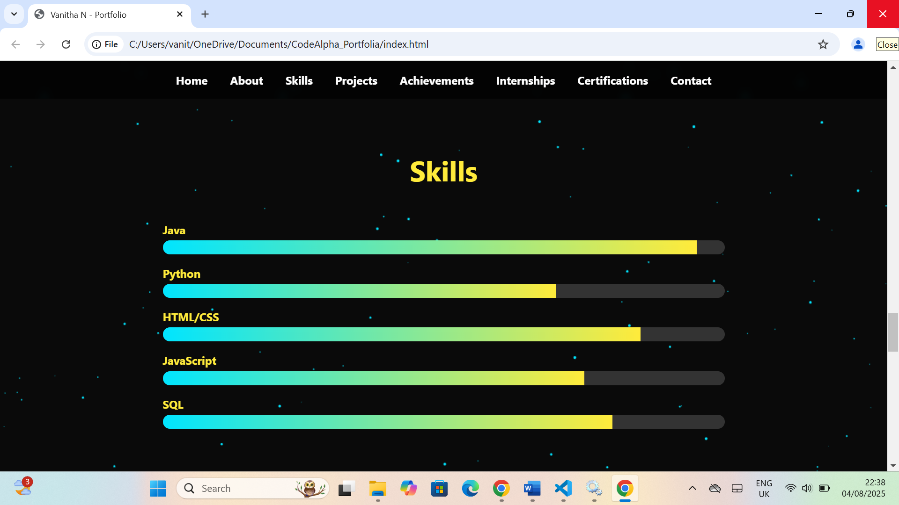

# 🌟 Personal Portfolio Website
A fully responsive **Personal Portfolio Website** showcasing skills, projects, achievements, internships, and certifications. Designed using **HTML, CSS, and JavaScript** with animations and smooth scrolling for an engaging user experience.
## ✅ Features
✔ **Responsive Design** – Works on all devices (desktop, tablet, mobile)  
✔ **Dynamic Background Animation** – Interactive particle effects using Canvas  
✔ **Smooth Scroll Navigation** – Quick access to sections  
✔ **About Section** – Personal introduction and resume download option  
✔ **Projects Section** – Displays completed projects with icons  
✔ **Achievements & Internships** – Highlights accomplishments and experience  
✔ **Skills with Animated Progress Bars** – Java, Python, HTML, CSS, JS, SQL  
✔ **Certifications Section** – List of completed courses and credentials  
✔ **Contact Section** – Email, LinkedIn, and phone number for easy communication  
## 🛠️ Technologies Used
- **HTML5** – Structure  
- **CSS3** – Styling and animations  
- **JavaScript (ES6)** – Functionality, background animation, and progress bars  
- **Font Awesome** – Icons for better UI  
## 📂 Project Structure
CodeAlpha-Portfolio/
│
├── index.html        # Main HTML file
├── style.css         # Styling file
├── script.js         # JavaScript file
├── profile.jpeg      # Profile image
├── preview.png       # Screenshot for README
└── README.md         # Project documentation
## 📸 Preview

## 🔗 Live Demo
👉 [**View My Portfolio**](https://your-username.github.io/Portfolio-Website)  
*(Replace with your actual GitHub Pages or Netlify link)*  
## 🚀 How to Run Locally
1. Clone this repository:
   ```bash
   git clone https://github.com/your-username/Portfolio-Website.git
