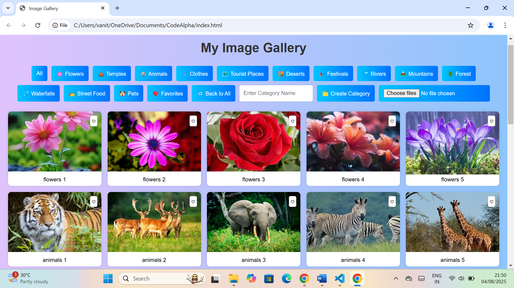

# 📸 Image Gallery

A beautiful and responsive **Image Gallery Web App** built using **HTML, CSS, and JavaScript**.  
This project allows users to browse images, filter by categories, view images in a **lightbox**, mark favorites, and even **upload new images**.

---

## ✅ Features
✔ Responsive Design – Works on desktop & mobile devices  
✔ Category Filtering – Show images by category  
✔ Lightbox View – Full-screen view with Next/Prev navigation  
✔ Slideshow Mode – Auto-play images in lightbox  
✔ Favorites – Mark and view your favorite images  
✔ Image Upload – Add your own images to the gallery  
✔ Create Custom Categories dynamically  
✔ Smooth Hover Effects & Transitions  

---

## 🛠️ Technologies Used
- HTML5 – Structure  
- CSS3 – Styling & Responsive Layout  
- JavaScript (ES6) – Functionality  

---

## 📂 Project Structure

```
CodeAlpha-Image-Gallary/
│
├── index.html        # Main HTML file
├── images/           # Folder containing gallery images
├── preview.png       # Screenshot for README
└── README.md         # Project documentation
```

➡ [**Click here to view the full project on GitHub**](https://github.com/VANITHA1011/CodeAlpha-Image-Gallary)

---

## 📷 Preview



*(Make sure you have `preview.png` in the same folder as this README.md)*  

---

## 🚀 How to Run
1. Clone the repository:
   ```bash
   git clone https://github.com/VANITHA1011/CodeAlpha-Image-Gallary.git
   ```
2. Open `index.html` in your browser.
