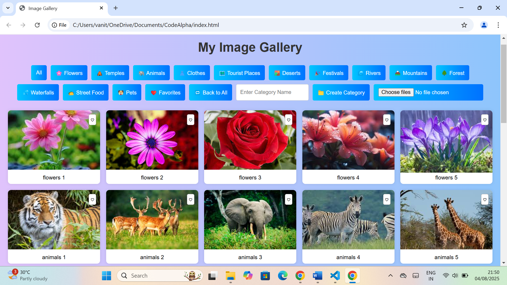
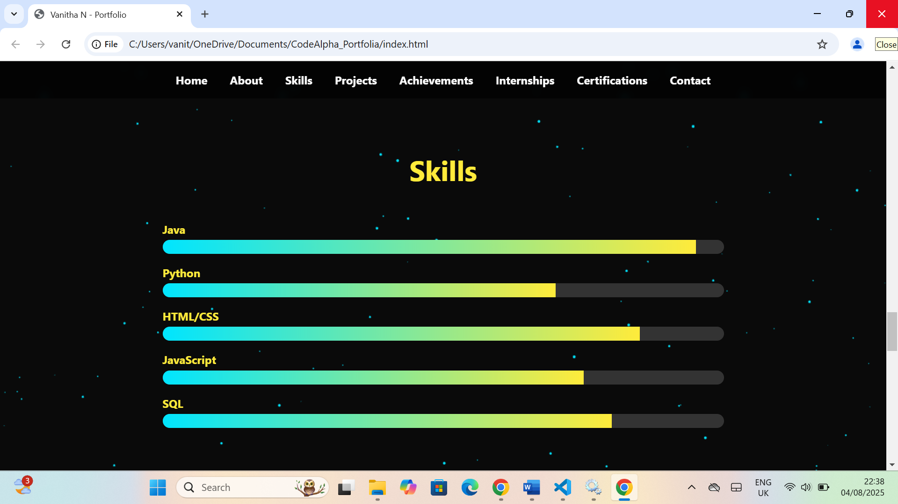

# CodeAlpha Internship Tasks (July Batch) 
# 🚀 CodeAlpha Internship - July Batch (Completed Tasks)

Welcome to my **CodeAlpha Internship** project repository!  
This repo contains all the tasks I successfully completed during my internship in **Front-End Development**.

---

## ✅ Completed Tasks:

### 🔹 **Task 1: Image Gallery**
- **Description:** A responsive image gallery built with HTML, CSS, and JavaScript.
- **Features:**
  - Multiple categories of images (Nature, Animals, Festivals, etc.)
  - Click to enlarge feature.
- **Folder:** [View Project](CodeAlpha_imageGallary)
- **Preview:**  
  

---

### 🔹 **Task 2: Calculator**
- **Description:** A simple and stylish calculator using HTML, CSS, and JavaScript.
- **Features:**
  - Addition, Subtraction, Multiplication, Division.
- **Folder:** [View Project](CodeAlpha_Calculator)
- **Preview:**  
  

---

### 🔹 **Task 3: Portfolio Website**
- **Description:** A modern personal portfolio showcasing my skills and projects.
- **Features:**
  - Responsive design for all devices.
  - Sections: About, Skills, Projects, Contact.
- **Folder:** [View Project](CodeAlpha_Portfolia)
- **Preview:**  
  

---

### 🔹 **Task 4: Music Player**
- **Description:** A web-based music player using HTML, CSS, and JavaScript.
- **Features:**
  - Play, Pause, Previous, Next controls.
  - Playlist with thumbnails.
- **Folder:** [View Project](CodeAlpha_MusicPlayer)
- **Preview:**  
  

---

## 🔗 **Connect With Me**
- **LinkedIn:** [Vanitha N](https://www.linkedin.com/in/vanitha-n-7587b428a/)
- **GitHub:** [VANITHA1011](https://github.com/VANITHA1011)

---

✨ **Thank you CodeAlpha for this amazing learning experience!**  
